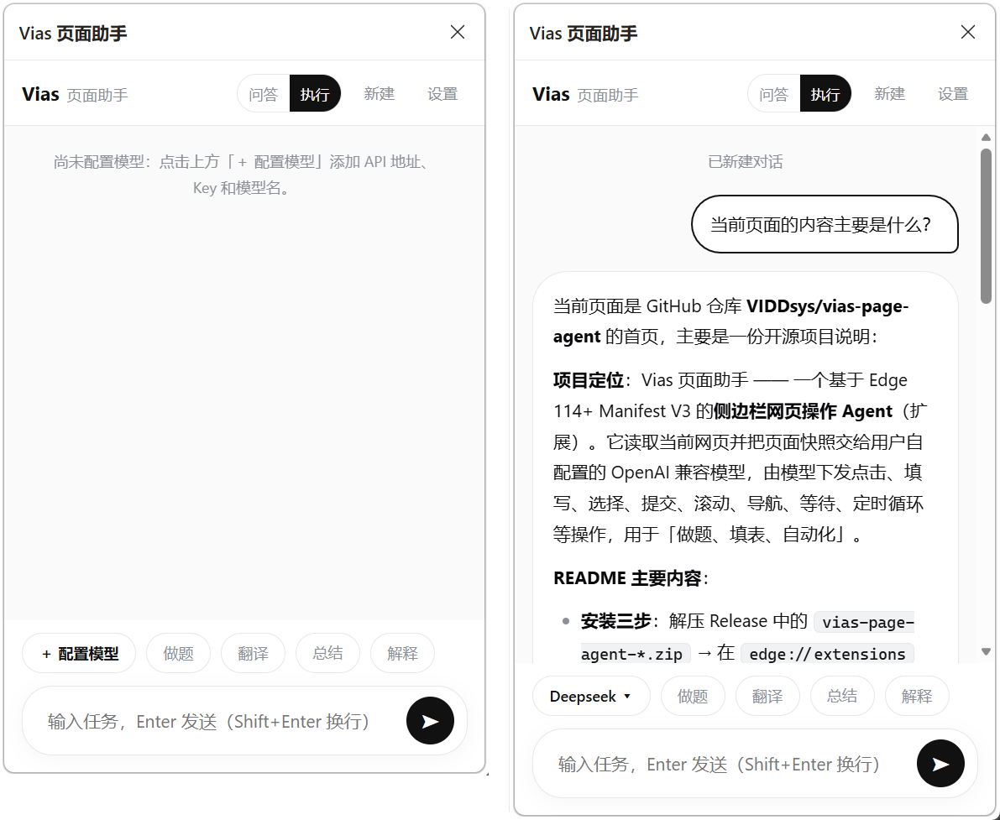

# Vias 页面助手



Vias 是一个 Edge 114+ Manifest V3 侧边栏网页代理。它读取当前页面，把页面快照交给用户配置的 OpenAI 兼容模型，并执行点击、填写、选择、提交、滚动、导航、等待和定时循环等操作。


## 安装（三步上手）

1. **解压**：把 Release 里的 `vias-page-agent-*.zip` 下载后解压到任意固定目录（别放临时目录，删除会导致扩展失效）。
2. **加载扩展**：Edge 地址栏输入 `edge://extensions` → 打开左下角「开发人员模式」→ 点「加载解压缩的扩展」→ 选中解压出来的文件夹。
3. **配置模型**：点浏览器右上角 Vias 图标（或扩展页的「侧边栏」按钮）在侧边栏打开 → 点右上角「设置」→ 填 OpenAI 兼容接口地址、API Key、模型名 → 保存。

之后在任意网页打开侧边栏，点「执行」即可让它自动操作页面（做题、填表等），「问答」则只读不改页面。

> 修改源码后需在 `edge://extensions` 点「重新加载」生效。

## 模型设置与隐私
## 模型设置与隐私

- 支持任意 OpenAI Chat Completions 兼容接口。
- API Key 仅保存在 `chrome.storage.local`，不上云同步。
- 页面文字会发送给当前选择的 API。
- 页面图片默认关闭；只有为该模型显式开启「允许向模型发送页面图片」后，才会发送提取图片或可视区截图。
- 模型网络请求由可见侧边栏发起，避免 MV3 Service Worker 的 30 秒 `fetch` 响应限制中断长推理。
- 无鉴权的本地模型不会收到空的 `Authorization` 请求头。

## 可靠性设计

### 快照与定位

每次提取都会生成新的 `snapshotId` 和 ref 映射。模型只能使用最新快照中的编号；旧快照操作会以 `STALE_SNAPSHOT` 拒绝，避免页面更新后误点同编号的其他元素。

提取支持：

- 常见原生控件、ARIA 控件、富文本和纯文本列表项；
- open Shadow DOM；
- 长正文保留，不再整段丢弃；
- 隐藏节点过滤，同时正确处理 `display: contents`；
- 密码与敏感自动完成字段脱敏；
- 可选图片提取，并有总量、尺寸、超时和资源释放限制。

跨域 iframe、封闭 Shadow DOM 仍受浏览器安全边界限制。

### 操作事务

每个任务都有独立 `runId`，每批操作都有 `operationId`：

- 同一 `operationId` 只执行一次；
- 不再使用「10 秒内相同 actions」的模糊指纹，用户有意重复操作不会被误拦截；
- 同一页面只允许一批操作执行；
- 前序操作失败、任务取消或页面跳转后，剩余操作会明确跳过；
- `check` 是语义幂等的，不会把已经选中的复选框反选；
- `fill` 相同值不会重复触发 input/change；
- `repeat` 禁止嵌套，子操作失败立即停止，并可在等待中快速取消。

### 任务生命周期

- 防止双击发送产生两个任务；
- 所有后台事件按 `runId` 隔离，旧任务不能污染新任务；
- 停止会取消在途模型请求、页面等待和 repeat；
- 侧边栏关闭或连接中断会主动停止页面任务，不会建议盲目重发提交操作；
- 连续重复操作或连续无进展会熔断；
- 新标签页按 opener 关系跟随，但不再永久篡改网页的 `window.open`、`confirm` 或 `alert`。

### 执行边界

- 所有操作自动执行，不弹确认卡片（完全访问权限模式）。
- 防失控熔断：同一操作连续重复 2 次停止、连续 3 轮无任何操作成功停止、单任务最多 50 轮。
- 请仅在你自己负责的页面和账号上使用。

## 使用

- 「问答」：只读取页面并回答，不执行页面操作。
- 「执行」：最多运行 50 轮，实时显示动作与结果。
- 运行中发送按钮变为停止按钮；停止完成前不会开启第二个任务。
- 对话记录按浏览器窗口隔离，保存于 `chrome.storage.session`。
- Markdown 会经过 DOMPurify；远程图片、媒体和嵌入内容被移除，链接强制使用安全的新窗口策略。

## 本地验证

使用 Node.js 22：

```bash
node --check core.js
node --check background.js
node --check content.js
node --check sidepanel.js
node --check options.js
node --check main-world.js
node --test tests/static.test.js
```

安装 `playwright-core@1.55.0` 后可运行：

```bash
node tests/content.e2e.js
node tests/extension.smoke.js
node tests/agent.integration.js
```

当前测试覆盖 manifest、模型请求适配、任务协议、安全边界、真实 Edge 扩展加载，以及快照/ref、DOM 变化后旧快照拒绝、fill/check 幂等、operationId、repeat 取消、长文本、Shadow DOM 和密码脱敏；完整集成测试还覆盖本地假模型 → 侧边栏 → 后台 Agent → 页面操作 → 新快照反馈 → 最终回复。

## 已知边界

- 浏览器内部页面、扩展商店页面不可读取。
- 跨域 iframe 和 closed Shadow DOM 不可深入。
- 文件上传、拖拽、跨窗口桌面操作暂不支持。
- 某些网站只接受受信任的物理输入事件，浏览器脚本无法伪造 `isTrusted=true`。
- 原生 `confirm`/`alert` 不再自动接受；出现阻塞弹窗时需要用户手动处理，这是为了避免未经确认的不可逆操作。
- 自动化测试不能代替目标网站矩阵回归。发布前应在实际使用站点执行登录、搜索、动态表单、SPA 路由、新标签、长任务和中途停止测试。
