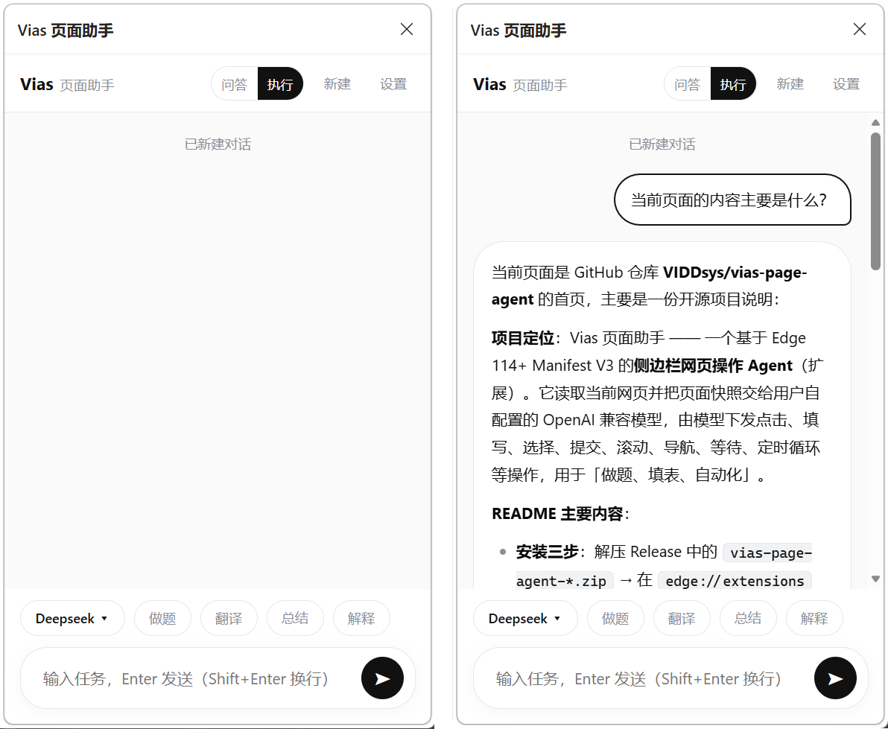

# Vias 页面助手



Edge 侧边栏网页操作 Agent（Manifest V3）。它读取当前页面，把页面快照交给你配置的 OpenAI 兼容模型，由模型执行点击、填写、选择、提交、滚动、导航等操作，可用于做题、填表、页面自动化。

## 安装

1. 从 [Release](https://github.com/VIDDsys/vias-page-agent/releases) 下载 zip，解压到一个固定目录（删除该目录扩展即失效）。
2. Edge 打开 `edge://extensions`，开启「开发人员模式」，点「加载解压缩的扩展」，选中解压出的文件夹。
3. 打开侧边栏，点右上角「设置」，点「添加模型」填入 OpenAI 兼容接口地址、API Key、模型名后保存。

在任意网页打开侧边栏：「执行」自动操作页面，「问答」只读不改页面。修改源码后需在扩展管理页点「重新加载」。

## 模型与隐私

- 支持任意 OpenAI Chat Completions 兼容接口；API Key 只存在本地 `chrome.storage.local`，不上云同步。
- 页面文字会发送给你配置的 API；页面图片默认不发，需在模型设置中显式开启。
- 模型请求由侧边栏发起，规避 MV3 Service Worker 的 30 秒 fetch 限制。

## 工作机制

- **快照定位**：每次提取生成新的 `snapshotId` 和元素编号（ref），模型只能用最新编号操作；页面跳转或目标身份变化时拒绝旧操作，无关页面更新不影响有效目标。支持原生控件、ARIA 控件、富文本、列表项和 open Shadow DOM；敏感字段脱敏。
- **操作幂等**：同一 `operationId` 只执行一次；`check` 不会反选已勾选项；`fill` 相同值不重复触发事件；`repeat` 禁止嵌套，可随时取消。
- **任务隔离**：每个任务独立 `runId`，停止即取消在途请求和页面等待；相同操作连续两轮无进展、连续三轮执行/通信失败或无效参数时自动停止，正常推进的任务最多 50 轮。
- **模型协议**：只接受最终回答，不执行推理草稿或截断输出；只有明确的 `done:true` 才判定任务完成。已失效的页面全文和图片不在后续请求中重复保留，操作历史使用有界摘要，不缩短实际执行的填写内容。
- **执行模式**：所有操作自动执行、不弹确认，请只在自己负责的页面和账号上使用。

## 验证

```bash
npm run check
npm test
# 安装 package.json 中的开发依赖并使用系统 Edge：
npm run test:all
```

`test:all` 覆盖语法、模型协议、任务循环、内容脚本、真实扩展加载、代理集成和侧栏/设置页。浏览器测试使用临时隔离配置及本地假模型，不读取日常浏览器配置，不调用付费接口。

## 已知边界

- 浏览器内部页面、扩展商店不可读取；跨域 iframe 和 closed Shadow DOM 不可深入。
- 文件上传、拖拽暂不支持；部分网站只接受真实物理输入（`isTrusted=true` 无法伪造）。
- 原生 `confirm`/`alert` 弹窗需手动处理；自动化测试不能代替目标网站实测。
